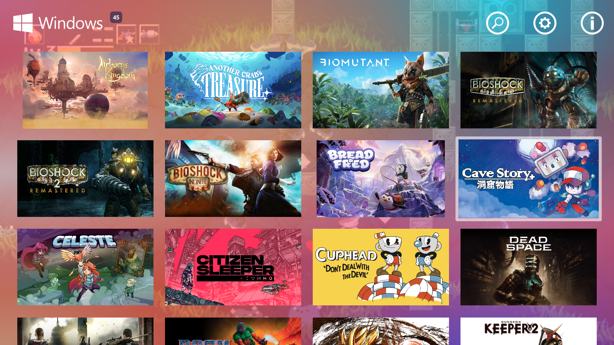
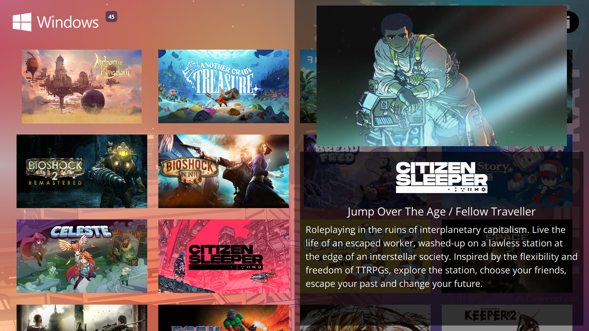
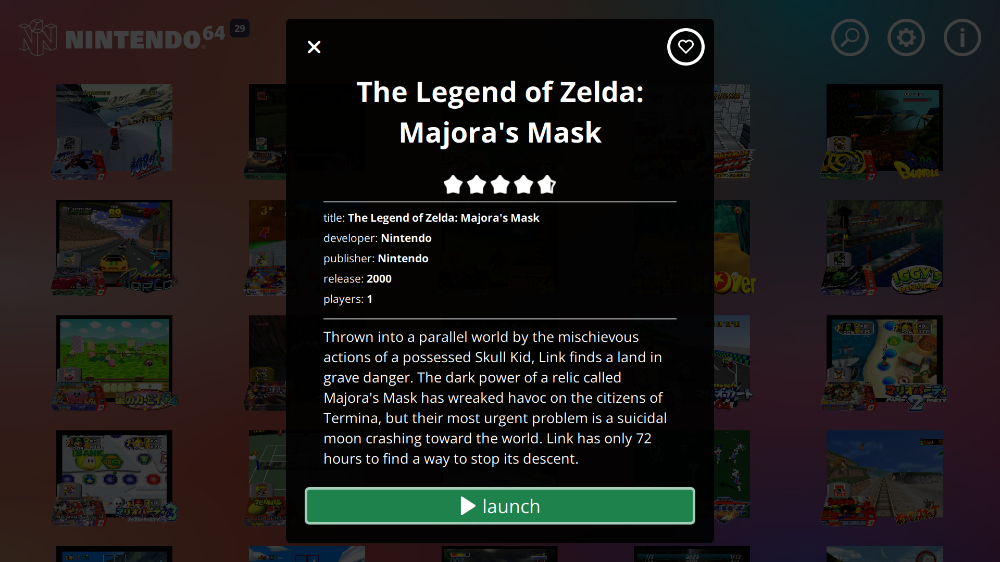
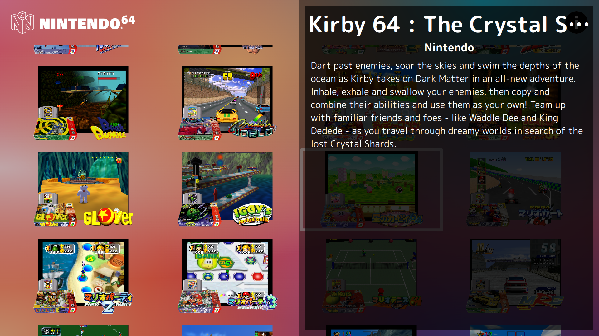
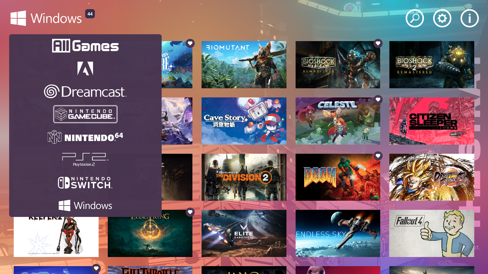
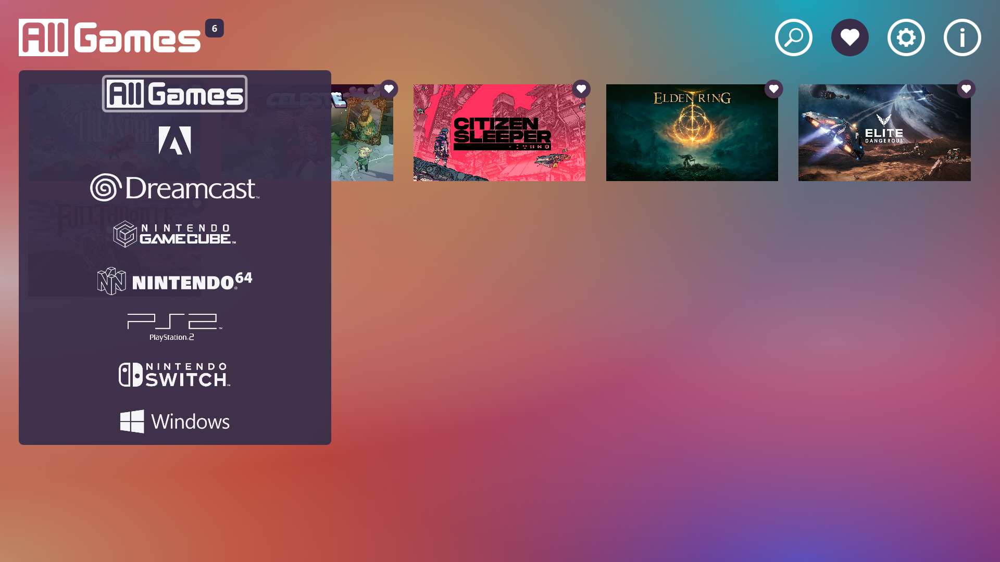

# struceOS-Pegasus-Theme








# struceOS theme for [Pegasus Frontend](http://pegasus-frontend.org/)
A simple theme for easy navigation.

- Supports navigation using gamepad and keyboard/mouse. (settings panel controls TK)
- Info panel with video player.
- Customizable settings.

If you have any issues, please open a ticket or let me know on [discord](https://discord.gg/Pa92b2Q2pa)

# Metadata Generation and Asset Scraping
I recommend using [muldjord's skyscraper](https://github.com/muldjord/skyscraper) for metadata generation. Simply follow the directions for your installation type. Example commands below (tested in PowerShell on Windows 11):

<details>
    <summary>skyscraper commands</summary>
I setup my pegasus emulators as such:
    
    /Emulators
        /Dreamcast
        /Gamecube
        /Genesis
        /N64
        /PS2
            /_games
                (contains all roms)
            /_media
                (will store assets dowloaded by skyscraper)
            /_emulator
                (usually named the same as the emulator eg: _PCSX2)
        /Switch

config.ini and struceos-artwork.xml can be found in skyscraper-config or can be created manually

Add to config.ini: 

    [screenscraper]
    videos="true"

    [pegasus]
    videos="true"

struceos-artwork.xml:

    <?xml version="1.0" encoding="UTF-8"?>
    <artwork>
        <output type="screenshot" resource="screenshot"/>
        <output type="cover" resource="cover"/>
        <output type="wheel" resource="wheel"/>
        <output type="marquee" resource="marquee"/>
    </artwork>

Commands:

    Pull data:
    skyscraper -p {platform} -s {source} -i {path/to/roms} --region {eu, us, jp, wor} --refresh

    skyscraper -p ps2 -s screenscraper -i f:\Games\Emulators\PS2\_games --region us --refresh

    Output metadata.pegasus.txt:
    skyscraper -p {platform} -f pegasus -a {path/to/struceos-artwork.xml} -e "{path/to/emulator} {file.path}" -i {path/to/roms} -g {output/path/metadata.pegasus.txt} -o {output/path/assets}

    skyscraper -p ps2 -f pegasus -a "[REDACTED]\Local\pegasus-frontend\themes\struceOS-Pegasus-Theme-main\skyscraper-config\struceos-artwork.xml" -e "_PCSX2\pcsx2-qt.exe {file.path}" -i f:\Games\Emulators\PS2\_games -g f:\Games\Emulators\PS2 -o f:\Games\Emulators\PS2\_media

</details>

These commands will generate a metadata.pegasus.txt file that will have the necessary assets for the theme if they are available through [screenscraper.fr](https://www.screenscraper.fr/). Otherwise placeholders are used.

A full set of assets for manual setup would be (multiples listed in order of priority):
1. **assets.screenshots/assets.screenshot/assets.background** - used for the background image when the game is selected (will randomly rotate through assets.screenshots if available)
2. **assets.banner/assets.boxFront/assets.logo** - used for the thumbnail image in the gameView (logo is a last resort)
3. **assets.logo/assets.wheel** - used for the logo in the info panel
4. **assets.video** - used for the video in the info panel

# Version 1.3.1 Updates
1. Added favorite toggle to gameView
2. Fixed favorite icon placement in gameView
3. Added text labels to games with default banner image
4. Changed game count to update with filters
5. Updated gameView controls to use built in functions

# Thank yous
Thank you to both [VGmove (EasyLaunch)](https://github.com/VGmove/EasyLaunch) and [PlayingKarrde (clearOS)](https://github.com/PlayingKarrde/clearOS). I used your themes to build this theme.

# To come in future updates
1. Gamepad and Keyboard controls for the settings panel

# Controls
- Keyboard/Mouse
    - Navigate: WASD / Arrow Keys / Mouse click
    - Prev/Next Collection: Q / E
    - Toggle Info Panel: I 

- Gamepad
    - Navigate: Joystick / D-Pad
    - Prev/Next Collection: RB / LB
    - Toggle Info Panel: X / ▢

# Customizable Settings
The most useful settings are now in a settings panel within the theme. The rest can be found in template/Settings.qml. The default settings are below for reference:
<details>
    <summary>Default Settings</summary>

    property var colors: {
        "martinique" : "#392e4a",
        "green" : "#1ba39c",
        "border": Qt.rgba(1,1,1,0.6),
        "white": Qt.rgba(1,1,1,1),
        "black": Qt.rgba(0,0,0,1),
        "black90": Qt.rgba(0,0,0,0.90),
        "black75": Qt.rgba(0,0,0,0.75)
    }

    //Fonts
    property string fontFamilyRegular: 
        "assets/fonts/Open Sans/OpenSans-Regular.ttf"
    property string fontFamilyBold: 
        "assets/fonts/Open Sans/OpenSans-Bold.ttf"

    //gameView Settings
    property int columns:                                                   //Number of columns to display in gameView
        api.memory.get("struceOS_gameView_columns") != undefined ?
        api.memory.get("struceOS_gameView_columns") :
        4
    property int columnsMax: 10                                             //Maximum columns in gameView
    property int columnsMin: 3                                              //Minimum columns in gameView
    property var croppedThumbnails:                                         //Array of game.shortName--banner images will be scaled to fill
        api.memory.get("struceOS_gameView_croppedThumbnails") != undefined ? 
        api.memory.get("struceOS_gameView_croppedThumbnails") :
        []                                                     
    property bool lastPlayed:                                               //Open to last game played--otherwise opens to last selected
        api.memory.get("struceOS_gameView_lastPlayed") != undefined ? 
        api.memory.get("struceOS_gameView_lastPlayed") :
        true
    property bool allGames: 
    api.memory.get("struceOS_gameView_allGames") != undefined ?
    api.memory.get("struceOS_gameView_allGames") :
    true                                                                    //Turns on the All Games Category (Under Development)
                                                                            //currently doubles up if games are contained in two collections (windows/pc)
    property string defaultGameImage: "img/no_image.png"                    //Image source for default game image (will only look in assets)

    //Background Settings
    property bool bgOverlayOn:                                              //Apply an overlay to the background
        api.memory.get("struceOS_background_overlayOn") != undefined ?
        api.memory.get("struceOS_background_overlayOn") :
        true
    property real bgOverlayOpacity:                                         //Overlay opacity 
        api.memory.get("struceOS_background_overlayOpacity") != undefined ?
        api.memory.get("struceOS_background_overlayOpacity") :
        0.75
    property string bgOverlaySource: "img/bg-gradient.png"                  //Image source for the background overlay (will only look in assets)
    
    //Video Settings
    property bool videoMute:                                                //Mute video by default
        api.memory.get("struceOS_video_videoMute") != undefined ?
        api.memory.get("struceOS_video_videoMute") : 
        true
    property real videoVolume:                                              //Video volume
        api.memory.get("struceOS_video_volume") != undefined ?
        api.memory.get("struceOS_video_volume") :
        0.40

    //Search Settings
    property var firstWordIgnore: 
        ["the","the legend of", "the legend of zelda:", "lego"]             //Words to ignore at the beginning

    //DevTools
    property bool enableDevTools:                                           //Dispalys "console" and a button for testing purposes 
        api.memory.get("struceOS_dev_enableDevTools") != undefined ?
        api.memory.get("struceOS_dev_enableDevTools") :
        false
    property real consoleLogBackground:                                     //clog background opacity
        api.memory.get("struceOS_dev_log_opacity") != undefined ?
        api.memory.get("struceOS_dev_log_opacity") :
        0.5
    property string version: "1.3.0"                                        //struceOS version
    property bool working: false
</details>

# Installation
Download the theme and place it in your [Pegasus theme directory](http://pegasus-frontend.org/docs/user-guide/installing-themes/).

# Download
Download struceOS-Pegasus-Theme-1.3.1.zip from [last releases](https://github.com/strucep/struceOS-Pegasus-Theme/releases).

[](https://ko-fi.com/I2I2ZB6VK)

<details>
    <summary>Changelogs</summary>

## 1.3.1

```
1. Added favorite toggle to gameView
2. Fixed favorite icon placement in gameView
3. Added text labels to games with default banner image
4. Changed game count to update with filters
5. Updated gameView controls to use built in functions
```

## 1.3.0

```
1. Updated collection logos
2. Simplified toggling panels
3. Fixed background images when searching
4. Changed audio files for UI sounds
5. Updated header layout and functions
6. Updated info panel layout and functions
```

## 1.2.1

```
1. Added All Games to the collection dropdown menu
2. Collection dropdown resizes to list length if shorter than the full window
3. Removed clog statements from testing
```

## 1.2.0

```
1. Added game count to collection title
2. Added collection dropdown menu
```

## 1.1.0

```
1. Split theme.qml into separate files for easier editing
2. Moved common functions to js
2. Updated header logic
3. Added Search functionality
4. Added an in app Settings panel
5. Added an All Games collection 
6. Fixed GoG and Steam collections
```

## 1.0.1

```
1. Fixed audio discrepancies in button presses
2. Fixed unused settings properties
3. Added additional settings to the customizable settings
```

## 1.0.0

```
1. Initial release.
```
</details>
