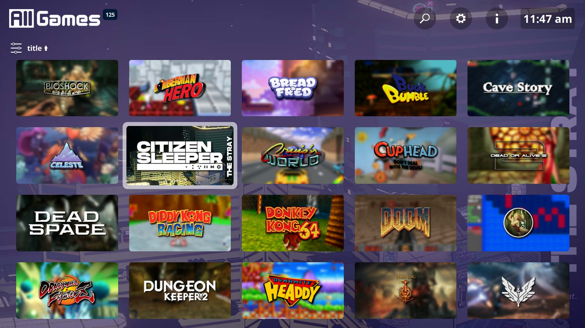
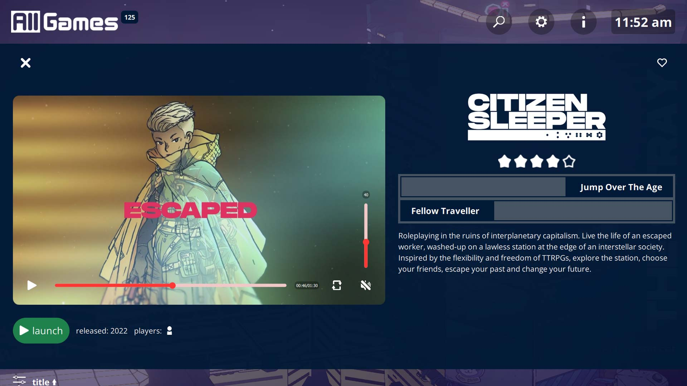
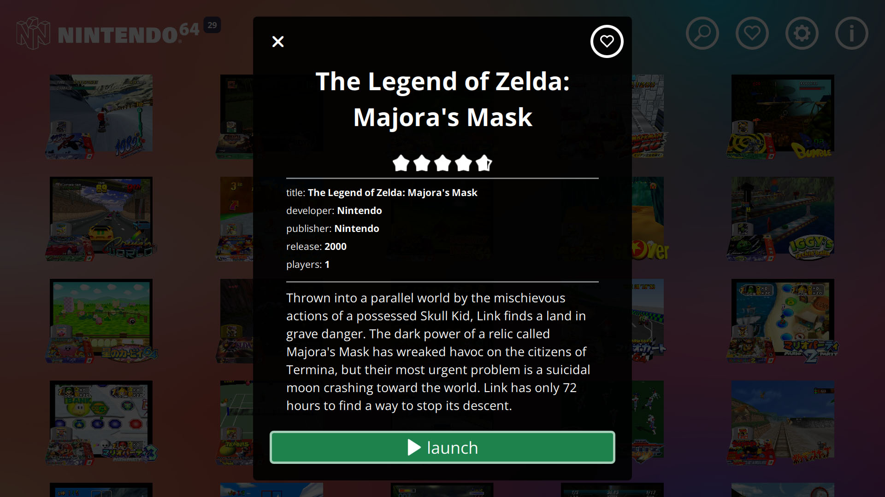
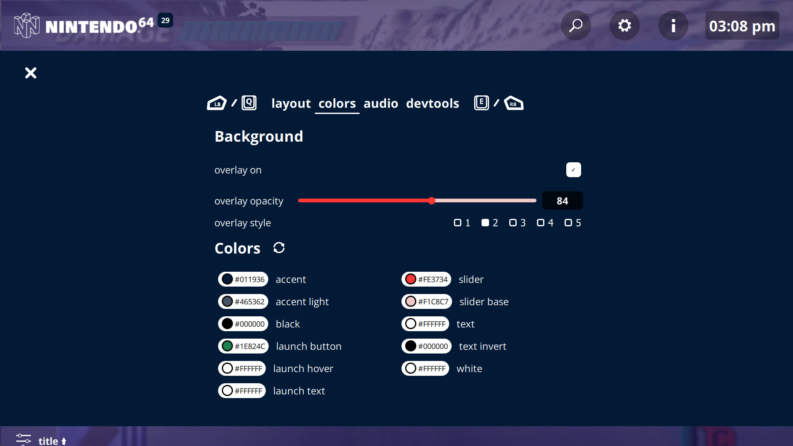
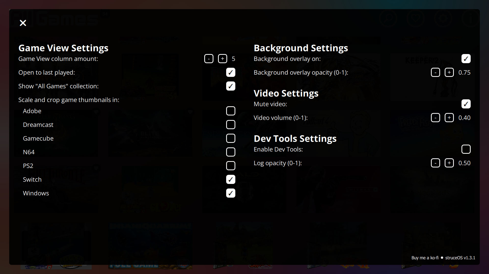
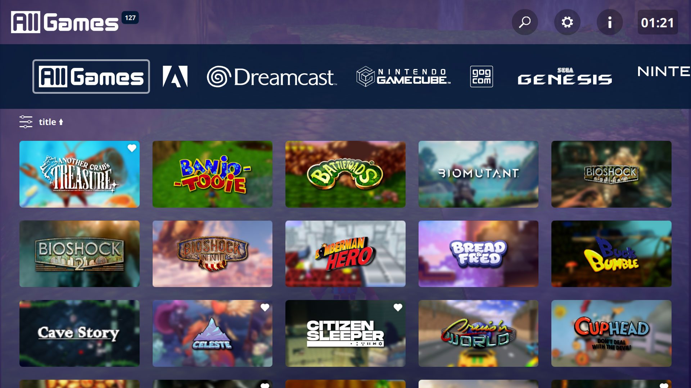

# struceOS-Pegasus-Theme

- [Description](#description)
- [Version Updates](#current-version)
- [To come in future updates](#to-come)
- [Metadata Generation and Asset Scraping](#meta-data)
- [Controls](#controls)
    - [Mouse/Keyboard](#controls-mkb)
    - [Gamepad](#controls-gamepad)
- [Settings](#settings)
- [Thank yous](#thank-yous)
- [Installation](#installation)
- [Download](#download)
- [Changelog](#changelog)








<a id="description"></a>
# struceOS theme for [Pegasus Frontend](http://pegasus-frontend.org/)
A simple theme for easy navigation.

If you have any issues, please open a ticket or let me know on [discord](https://discord.gg/Pa92b2Q2pa)

<a id="current-version"></a>
# Version 1.5.2 Updates
1. Code cleanup and refactoring

<a id="to-come"></a>
# To come in future updates
1. Add genre filters


<a id="meta-data"></a>
# Metadata Generation and Asset Scraping
I recommend using [muldjord's skyscraper](https://github.com/muldjord/skyscraper) for metadata generation. Simply follow the directions for your installation type. Example commands below (tested in PowerShell on Windows 11):

<details>
    <summary>skyscraper commands</summary>

I set up my emulators for pegasus as such:
    
    /Emulators
        /Dreamcast
        /Gamecube
        /Genesis
        /N64
        /PS2
            /_games
                (contains all roms)
            /_media
                (will store assets dowloaded by skyscraper)
            /_emulator
                (usually named the same as the emulator eg: _PCSX2)
        /Switch

config.ini and struceos-artwork.xml can be found in skyscraper-config or can be created manually

Add to config.ini: 

    [screenscraper]
    videos="true"

    [pegasus]
    videos="true"

struceos-artwork.xml:

    <?xml version="1.0" encoding="UTF-8"?>
    <artwork>
        <output type="screenshot" resource="screenshot"/>
        <output type="wheel" resource="wheel"/>
    </artwork>

Commands:

    Pull data:
    skyscraper -p {platform} -s {source} -i {path/to/roms} --region {eu, us, jp, wor} --refresh

    skyscraper -p ps2 -s screenscraper -i f:\Games\Emulators\PS2\_games --region us --refresh

    Output metadata.pegasus.txt:
    skyscraper -p {platform} -f pegasus -a {path/to/struceos-artwork.xml} -e "{path/to/emulator} {file.path}" -i {path/to/roms} -g {output/path/metadata.pegasus.txt} -o {output/path/assets}

    skyscraper -p ps2 -f pegasus -a "[REDACTED]\Local\pegasus-frontend\themes\struceOS-Pegasus-Theme-main\skyscraper-config\struceos-artwork.xml" -e "_PCSX2\pcsx2-qt.exe {file.path}" -i f:\Games\Emulators\PS2\_games -g f:\Games\Emulators\PS2 -o f:\Games\Emulators\PS2\_media

</details>

These commands will generate a metadata.pegasus.txt file that will have the necessary assets for the theme if they are available through [screenscraper.fr](https://www.screenscraper.fr/). Otherwise placeholders are used.

A full set of assets for manual setup would be (multiples listed in order of priority):
1. **assets.screenshots/assets.screenshot/assets.background/assets.banner/assets.boxFront** - used for backgrounds
2. **assets.logo/assets.wheel** - used for the logo
3. **assets.video** - used for the video

[More info](https://pegasus-frontend.org/docs/themes/api/#assets) on Pegasus' handling of assets

# Controls
<a id="controls-mkb"></a>
- Keyboard/Mouse
    - Navigate: WASD / Arrow Keys / Mouse click
    - Prev/Next Collection: Q / E / - / =
    - Quick collection select: 1 - 9
    - Open Info Panel: I
    - Open Sort and Filters: F
    - Select: Enter / Space
    - Pegasus Menu: Esc

<a id="controls-gamepad"></a>
- Gamepad
    - Navigate: Joystick / D-Pad
    - Previous/Next collection: LB / RB
    - Open Info Panel: X (Xbox) / ▢ (PS)
    - Open Sort and Filters: Y (Xbox) / △ (PS)
    - Select: A (Xbox) / X (PS)
    - Pegasus Menu: B (Xbox) / ⭘

# Settings
The most useful settings are now in a settings panel within the theme. The rest can be found in template/Settings.qml. The default settings are below for reference:

<details>
    <summary>Default Settings</summary>

    //fonts
    property string fontFamilyRegular: 
        "assets/fonts/Open Sans/OpenSans-Regular.ttf"
    property string fontFamilyBold: 
        "assets/fonts/Open Sans/OpenSans-Bold.ttf"

    //ui
    property int hover_speed: 100
    
    property string headerSize: api.memory.get("struceOS_ui_headerSize") || "m"

    property bool twelvehour: 
        api.memory.get("struceOS_ui_twelvehour") != undefined ?
            api.memory.get("struceOS_ui_twelvehour") : true

    property bool buttonHints:
        api.memory.get("struceOS_ui_buttonHints") != undefined ?
            api.memory.get("struceOS_ui_buttonHints") : true
            
    //audio
        //video
        property bool videoMute:
            api.memory.get("struceOS_video_videoMute") != undefined ?
                api.memory.get("struceOS_video_videoMute") : true

        property real videoVolume: api.memory.get("struceOS_video_volume") || 0.40
    
        //ui
        property bool uiMute: 
            api.memory.get("struceOS_ui_Mute") != undefined ?
                api.memory.get("struceOS_ui_Mute") : false

        property real uiVolume: api.memory.get("struceOS_ui_volume") || 0.40

    //game_layout
    property int columns: api.memory.get("struceOS_gameLayout_columns") || 5

    property bool lastPlayed: 
        api.memory.get("struceOS_gameLayout_lastPlayed") != undefined ?
            api.memory.get("struceOS_gameLayout_lastPlayed") : true

    property bool allGames: 
        api.memory.get("struceOS_gameLayout_allGames") != undefined ?
            api.memory.get("struceOS_gameLayout_allGames") : true

    property bool showThumbs: 
        api.memory.get("struceOS_gameLayout_thumbnails") != undefined ?
            api.memory.get("struceOS_gameLayout_thumbnails") : true

    //background
    property bool bgOverlayOn:
        api.memory.get("struceOS_background_overlayOn") != undefined ?
            api.memory.get("struceOS_background_overlayOn") : true

    property real bgOverlayOpacity: api.memory.get("struceOS_background_overlayOpacity") || 0.75

    property string bgOverlay:
        api.memory.get("struceOS_background_overlaySource") != undefined ?
            api.memory.get("struceOS_background_overlaySource") : images.overlay_0002

    //devtools
    property bool enableDevTools:
        api.memory.get("struceOS_dev_enableDevTools") != undefined ?
            api.memory.get("struceOS_dev_enableDevTools") : false


    property real consoleLogBackground: api.memory.get("struceOS_dev_log_opacity") || 0.6

    property string version: "1.5.2"
    property string author: "my_name_is_p"
    property string name: "struceOS"
    property string details: "struceOS v" + version + (working ? "-working" : "")

    property bool working: false

    //Colors
    property var theme: 
        api.memory.get("struceOS_theme_colors") != undefined ?
            api.memory.get("struceOS_theme_colors") : JSON.parse(JSON.stringify(default_theme))
    
    property var default_theme: {
            "accent": "#011936",
            "accent_light": "#465362",
            "black": "#000000",
            "border": addAlphaToHex(0.6, "#FFFFFF"),
            "launch_button": "#1E824C",
            "launch_hover": "#FFFFFF",
            "launch_text": "#FFFFFF",
            "slider": "#FE3734",
            "slider_base": "#F1C8C7",
            "t": "transparent",
            "text": "#FFFFFF",
            "text_invert": "#000000",
            "white": "#FFFFFF",
        }
</details>

# Thank yous
Thank you to [VGmove (EasyLaunch)](https://github.com/VGmove/EasyLaunch) and [PlayingKarrde (clearOS)](https://github.com/PlayingKarrde/clearOS). I used your themes to build this theme.

# Installation
Download the theme and place it in your [Pegasus theme directory](http://pegasus-frontend.org/docs/user-guide/installing-themes/).

# Download
Download struceOS-Pegasus-Theme-1.5.2.zip from [last releases](https://github.com/my_name_is_p/struceOS-Pegasus-Theme/releases).

[](https://ko-fi.com/I2I2ZB6VK)

<a id="changelog"></a>
<details>
    <summary>Changelogs</summary>

## 1.5.2

```
1. Code cleanup and refactoring
```

## 1.5.1

```
1. Added button hints
2. Added color options to settings
3. Updated icons to change with color settings
```

## 1.5.0 

```
1. Moved panel items to new window
2. Added sort/filter menu
3. Added navigation for controllers/kb to all menus
4. Removed old code
5. Finished rewrite to simplify for now
```

## 1.4.1 - Unreleased

```
1. Moved sort/filter to top of gameView
2. Changed thumbnails to gameOS style
3. Continue rewrite to simplify
```

## 1.4.0 

```
1. Start of rewrite to simplify logic and improve modularity
2. Added a clock
3. Redesigned collection list
```

## 1.3.2 

```
1. Added UI Mute setting
2. Updated getAsset() function to getAssets()
3. Reworked asset usage to better fit Skyscraper output
4. Changed Search to match any title containing the search term
```

## 1.3.1

```
1. Added favorite toggle to gameView
2. Fixed favorite icon placement in gameView
3. Added text labels to games with default banner image
4. Changed game count to update with filters
5. Updated gameView controls to use built in functions
```

## 1.3.0

```
1. Updated collection logos
2. Simplified toggling panels
3. Fixed background images when searching
4. Changed audio files for UI sounds
5. Updated header layout and functions
6. Updated info panel layout and functions
```

## 1.2.1

```
1. Added All Games to the collection dropdown menu
2. Collection dropdown resizes to list length if shorter than the full window
3. Removed clog statements from testing
```

## 1.2.0

```
1. Added game count to collection title
2. Added collection dropdown menu
```

## 1.1.0

```
1. Split theme.qml into separate files for easier editing
2. Moved common functions to js
2. Updated header logic
3. Added Search functionality
4. Added an in app Settings panel
5. Added an All Games collection 
6. Fixed GoG and Steam collections
```

## 1.0.1

```
1. Fixed audio discrepancies in button presses
2. Fixed unused settings properties
3. Added additional settings to the customizable settings
```

## 1.0.0

```
1. Initial release.
```
</details>